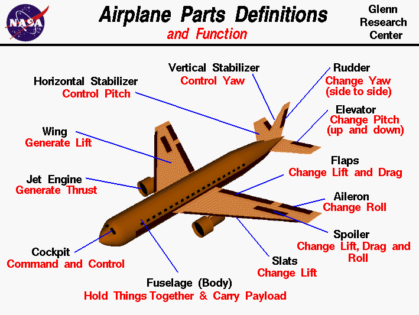

## Anatomy

## Glossary

- **Fuselage**: The main body of the airplane. Includes cockpit, passenger cabin and luggage compartment. In single-engine airplanes, the engine is usually mounted to the front of the fuselage.
- **Wings**: Generate lift. Contain fuel tanks.
- **Ailerons**: Flight control mounted to trailing edges of wings.
- **Flaps**: Flight control mounted to trailing edges of wings.
- **Nacelles**: Attaches engines to wings
- **Stabilizers**: Provides stability to the aircraft. Keeps it flying straight. The vertical stabilizer keeps the nose of the plane from swinging side to side. The horizontal stabilizer prevents an up-down motion.
- **Empennage**: The tail. Has vertical and horizontal stabilizers. Keeps the aircraft pointed straight ahead.
- **Elevator**: The flight control surface on the trailing edge of the horizontal stabilizer.
- **Rudder**: The flight control surface on the vertical stabilizer.
- **Powerplant**: Provides thrust. Could be a reciprocating gasoline engine connected to a propeller. Could be turboprop engines with propellers or turbofan engines.
- **Winglets**: On the tips of wings of modern airlines. Reduces drag.
- **Slats**: Used at takeoff to produce additional force.
- **Spoilers**: Used during landing to slow the plane down and to counteract the flaps when the plane is on the ground.

## Four Forces of Flight

### Lift

Generated by wings when air flows over them. Opposite of weight. If the plane is not climbing or descending, lift is equal to the force of weight.

Three ways to control lift:
- Speed. The more air that passes over the wing, the more lift is made.
- Raise the nose/increase angle of attack.
- Wing shape. Flaps can be used to make more lift as slower airspeeds (helpful when landing).

### Weight

Pulls the aircraft down. Not constant. Load factor measures how much the load increases in a given maneuver. In a 60deg bank turn, the plan will feel twice as heavy as it does in straight and level flight. Therefore, it will need twice as much lift.

### Thrust

The forward motion created by the powerplant.

Increase power = increase thrust
Decrease power = decrease thrust

### Drag

Force that holds the airplane back and resists forward motion.

Comes from:
- **Parasite drag**: Air flowing over the airplane. The fast you go, the more air flows over, the more drag is produced. If you double your airspeed, the plan makes four times as much drag. It is worst at high airspeeds.
- **Induced drag**: Made by wings when they make lift. It is worst at slow airspeeds.

Thrust is used to overcome drag.

## Three Movements in Flight

- **Pitch**: Nose up and down
- **Roll**: One wing up, the other down
- **Yaw**: Nose left and right

## Primary Flight Controls

### Elevator

Controls pitch. Moves up when yoke is pulled. Moves down when yoke is pushed.

### Ailerons

Control roll. When one goes up, the other goes down. Controlled by turning the yoke left or right.

### Rudder

Controls yaw. Rudder deflects left when left foot pedal is pushed.

## Secondary Flight Controls

### Flaps

Controlled by a small lever. Most planes have an electric motorized system that extends the flaps when the switch is moved. When extended, more lift at slower airspeeds, but more drag.
### Trim

Changed by wheel in the cockpit or a thumb switch on the yoke. Allows the pilot to neutralize the control force. Works by moving a small tab on the elevator's trailing edge. When moved, the elevator forces change, so the pilot doesn't have to. 
